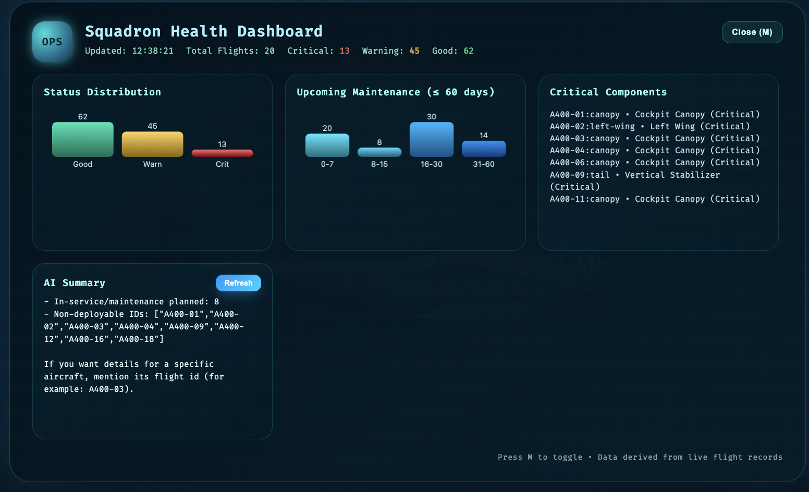

# BMW X5M Fleet Monitor 🚗

[](https://opensource.org/licenses/MIT)
[](https://nodejs.org/)
[](https://threejs.org/)

**Interactive 3D Vehicle Fleet Management System with Professional Studio Lighting**

A sophisticated web-based fleet monitoring application featuring real-time 3D visualization of BMW X5M vehicles with professional-grade lighting, interactive component inspection, and AI-powered health diagnostics.



## ✨ Features

### 🎨 **Professional 3-Point Lighting**
- **Key Light** (3.5 intensity) - Studio-grade primary illumination
- **Fill Lights** (1.75 intensity) - Dimensional depth with 50% key-to-fill ratio
- **Rim/Back Light** (2.8 intensity) - Edge separation and silhouette definition
- **D65 6500K** neutral white color temperature for accurate color reproduction

### 🚗 **3D Vehicle Visualization**
- High-quality BMW X5M 3D model with PBR materials
- Interactive component markers with real-time health status
- Auto-fit camera positioning for optimal framing
- Smooth animations with GSAP
- OrbitControls for intuitive navigation

### 📊 **Fleet Management**
- Real-time vehicle health monitoring
- Component-level diagnostics with fault codes
- Maintenance scheduling and priority tracking
- Multi-vehicle fleet overview
- Status indicators (Good, Warning, Critical)

### 🤖 **AI Integration**
- Azure OpenAI-powered chat assistant
- Intelligent fleet analysis and recommendations
- Natural language query support
- Maintenance prediction and insights

### 🎯 **Interactive Features**
- Hover effects on component markers
- Click to inspect detailed component information
- Visual feedback with pulsing animations
- Keyboard shortcuts for quick navigation
- Component health color coding

## 🚀 Quick Start

### Prerequisites

- Node.js 18.x or higher
- npm or yarn package manager
- Modern web browser with WebGL support

### Installation

1. **Clone the repository:**
   ```bash
   git clone https://github.com/Anjin-san-ai/BMW.git
   cd BMW
   ```

2. **Install dependencies:**
   ```bash
   npm install
   ```

3. **Configure environment variables:**
   ```bash
   cp .env.example .env
   ```
   
   Edit `.env` and add your API keys:
   ```env
   # Azure OpenAI Configuration
   AZURE_OPENAI_ENDPOINT=your-endpoint-here
   AZURE_OPENAI_KEY=your-key-here
   AZURE_OPENAI_DEPLOYMENT=your-deployment-name

   # Optional: NeuroSAN Integration
   NEURO_SAN_API_URL=your-neurosan-url
   NEURO_SAN_PROJECT_NAME=your-project
   ```

4. **Start the development server:**
   ```bash
   npm start
   ```

5. **Open in browser:**
   ```
   http://localhost:3000
   ```

## 🎮 Controls & Shortcuts

| Key | Action |
|-----|--------|
| `Mouse Drag` | Rotate camera around vehicle |
| `Mouse Wheel` | Zoom in/out |
| `Right Click + Drag` | Pan camera |
| `Click Marker` | Inspect component details |
| `F` | Toggle vehicle selector |
| `R` | Reset camera to default view |
| `D` | Toggle debug anchor visualization |
| `Esc` | Close active panels |
| `?` | Show help panel |

## 📁 Project Structure

```
BMW/
├── public/                 # Static assets
│   ├── index.html         # Main application
│   ├── app.css            # Styles
│   ├── scene.gltf         # BMW X5M 3D model
│   ├── scene.bin          # Model binary data
│   └── textures/          # PBR texture maps
│       ├── car_bmw_x5m_2014_*.png
│       ├── grille_*.png
│       └── lights_*.png
├── server/                 # Backend
│   ├── routes/
│   │   ├── ai.js          # AI chat endpoints
│   │   └── neurosan_client.js
│   ├── config.js          # Server configuration
│   └── prompts.json       # AI system prompts
├── data/                   # Data storage
│   ├── cars/              # Vehicle data files
│   │   ├── BMW-X5M-001.json
│   │   └── BMW-X5M-002.json
│   ├── cars.json          # Fleet registry
│   └── car_health.json    # Health status cache
├── server.js               # Express server
├── package.json
└── README.md
```

## 🛠️ Technical Stack

- **Frontend:**
  - Three.js r150 (3D rendering)
  - GSAP 3.x (animations)
  - Vanilla JavaScript (no framework overhead)

- **Backend:**
  - Node.js & Express
  - Azure OpenAI API
  - Body-parser for JSON handling

- **3D Assets:**
  - GLTF/GLB format
  - PBR materials (Metallic-Roughness workflow)
  - 2K texture resolution

## 🎨 Lighting Configuration

### Professional Studio Setup

```javascript
// Key Light (Primary)
Intensity: 3.5
Position: (3500, 8000, 4200)
Shadow Quality: 2048x2048

// Fill Lights (Ambient + Hemisphere)
Intensity: 1.75 each (~50% of key)
Color: D65 6500K neutral white

// Rim Light (Separation)
Intensity: 2.8
Position: (-6000, 3000, -8000)

// Background Gradient
Top: #303741 (neutral grey-blue)
Bottom: #14191E (subtle dark)
```

### Color Management
- **Workflow:** Linear RGB during rendering
- **Output:** sRGB for web display
- **Tone Mapping:** ACES Filmic for natural look
- **Exposure:** 1.2 (balanced)

## 📊 API Endpoints

### Vehicle Management
- `GET /api/cars` - List all vehicles
- `GET /api/cars/:id` - Get vehicle details
- `GET /api/fleet-summary` - Fleet overview

### AI Integration
- `POST /api/ai-chat` - Azure OpenAI chat
- `POST /api/neurosan-chat` - NeuroSAN analysis
- `GET /api/ai-summary-cache` - Cached summaries

### Configuration
- `GET /api/app-config` - Application settings
- `GET /api/tuner` - Tuning parameters

## 🔧 Configuration

### Server Configuration (`server/config.js`)

```javascript
module.exports = {
  port: process.env.PORT || 3000,
  dataDir: path.join(__dirname, '..', 'data'),
  azure: {
    endpoint: process.env.AZURE_OPENAI_ENDPOINT,
    key: process.env.AZURE_OPENAI_KEY,
    deployment: process.env.AZURE_OPENAI_DEPLOYMENT
  }
};
```

### 3D Scene Settings (`public/index.html`)

```javascript
// Model scale
const DEFAULT_VEHICLE_SCALE = 50.0;

// Camera settings
camera.fov = 50;
camera.near = 1;
camera.far = 100000;

// Lighting intensities
keyLight.intensity = 3.5;
ambient.intensity = 1.75;
rimLight.intensity = 2.8;
```

## 📖 Documentation

- **[Bug Fixes Summary](BUG_FIXES_SUMMARY.md)** - Detailed list of resolved issues
- **[Gesture Removal Status](GESTURE_REMOVAL_STATUS.md)** - Cleanup documentation
- **[Professional Lighting](PROFESSIONAL_LIGHTING_APPLIED.md)** - Lighting setup guide

## 🎯 Component Health Status

| Status | Color | Priority | Action |
|--------|-------|----------|--------|
| **Good** | 🟢 Green | Low | Regular maintenance |
| **Warning** | 🟡 Yellow | Medium | Schedule inspection |
| **Critical** | 🔴 Red | High | Immediate attention |

## 🚀 Deployment

### Production Build

```bash
# Set environment to production
export NODE_ENV=production

# Start the server
npm start
```

### Docker Deployment

```dockerfile
FROM node:18-alpine
WORKDIR /app
COPY package*.json ./
RUN npm install --production
COPY . .
EXPOSE 3000
CMD ["npm", "start"]
```

Build and run:
```bash
docker build -t bmw-fleet-monitor .
docker run -p 3000:3000 --env-file .env bmw-fleet-monitor
```

## 🤝 Contributing

Contributions are welcome! Please follow these steps:

1. Fork the repository
2. Create a feature branch (`git checkout -b feature/AmazingFeature`)
3. Commit your changes (`git commit -m 'Add some AmazingFeature'`)
4. Push to the branch (`git push origin feature/AmazingFeature`)
5. Open a Pull Request

## 📝 License

This project is licensed under the MIT License - see the [LICENSE](LICENSE) file for details.

## 🙏 Acknowledgments

- **Three.js** - 3D rendering engine
- **GSAP** - Animation library
- **Azure OpenAI** - AI integration
- **BMW** - 3D model inspiration

## 📧 Contact

**Imran Khan AN**
- GitHub: [@Anjin-san-ai](https://github.com/Anjin-san-ai)
- Repository: [BMW Fleet Monitor](https://github.com/Anjin-san-ai/BMW)

## 🔮 Future Enhancements

- [ ] Multi-vehicle comparison view
- [ ] Real-time telemetry integration
- [ ] Mobile responsive design
- [ ] VR/AR support
- [ ] Advanced analytics dashboard
- [ ] Fleet simulation mode
- [ ] Export diagnostics reports
- [ ] Multi-language support

---

**Built with ❤️ for automotive fleet management**

[](https://threejs.org/)
[](https://nodejs.org/)
[](https://azure.microsoft.com/en-us/services/cognitive-services/openai-service/)
